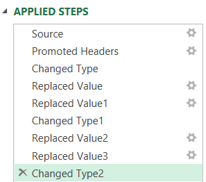
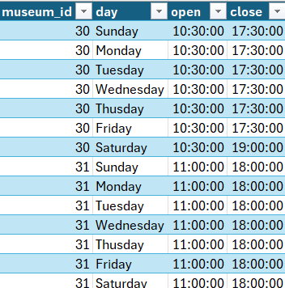

## Introduction
This project involves creating a structured database of famous paintings using multiple CSV files. The data is reformatted using Power Query in Excel, uploaded to an SQL Server database using Python and SQLAlchemy, and then queried to gain insights.

The main goal of this project is to learn how to effectively import CSV files into an SQL database using Python libraries; by being able to use different methods for data import, you gain flexibility and efficiency in handling diverse datasets, which is crucial for robust data management and analysis.

## Tools Used
- **Power Query in Excel**: For initial data reformatting.
- **Python**: For automating data upload to SQL Server.
    - **SQLAlchemy**: For establishing database connection and data manipulation.
    - **Pandas**: For reading and processing CSV files.
- **SQL Server**: For storing and querying the data.

## 1) Data Formatting with Power Query in Excel
Initial exploration of the 8 CSV files in Excel reveals that the opening and closing times in the museum_hours table are not formatted consistently. Power query is used to find and remove 'AM' and 'PM' characters and change the data type of the opening and closing time columns to time format so they can be recognised by SQL.

Below are the formatting steps used in Power Query, and part of the resulting table. By using Power Query to clean the data, the same steps can be immediately applied when new data is introduced, saving time and improving efficiency.




## 2) Python Data Import Script using SQLAlchemy
The data is now ready to be uploaded to an SQL database using different libraries in Python.

**Importing necessary libraries**:
```python
import pandas as pd
from sqlalchemy import create_engine
```
- pandas: A powerful data manipulation and analysis library.
- sqlalchemy: A SQL toolkit and Object-Relational Mapping (ORM) library.

**Define the database connection**:
```python
server = 'LAPTOP-NJLT4D0A'
database = 'paintings'
connection_string = f"mssql+pyodbc://{server}/{database}?driver=ODBC+Driver+17+for+SQL+Server&trusted_connection=yes"
```
- server: The name of the server hosting the SQL database.
- database: The name of the database to connect to.
- connection_string: A formatted string that specifies the details needed to connect to the SQL Server using the pyodbc driver and a trusted connection.
**Create the engine**:
```python
engine = create_engine(connection_string)
```
- create_engine: A function from SQLAlchemy that creates a connection to the database using the specified connection string.

**List of CSV files and their corresponding table names**:
```python
csv_files = {
    'artist.csv': 'artist',
    'canvas_size.csv': 'canvas_size',
    'image_link.csv': 'image_link',
    'museum.csv': 'museum',
    'museum_hours.csv': 'museum_hours',
    'product_size.csv': 'product_size',
    'subject.csv': 'subject',
    'work.csv': 'work'
}
```
- csv_files: A dictionary mapping the names of CSV files to the corresponding table names in the SQL database.

**Function to import a CSV file into a SQL table**:
```python
def import_csv_to_sql(csv_file, table_name):
    df = pd.read_csv(csv_file)
    df.to_sql(table_name, engine, if_exists='replace', index=False)
    print(f"Imported {csv_file} into {table_name}")
```
- import_csv_to_sql: A function that reads a CSV file into a pandas DataFrame (df), then uploads the DataFrame to the specified table in the SQL database.
- pd.read_csv(csv_file): Reads the CSV file into a DataFrame.
- df.to_sql(table_name, engine, if_exists='replace', index=False): Uploads the DataFrame to the specified SQL table. If the table already exists, it replaces it. The index=False parameter ensures that the DataFrame index is not written to the SQL table.
- print(f"Imported {csv_file} into {table_name}"): Prints a confirmation message.

**Import each CSV file**:
```python
for csv_file, table_name in csv_files.items():
    import_csv_to_sql(csv_file, table_name)
```
- Loops through the csv_files dictionary, calling the import_csv_to_sql function for each CSV file and its corresponding table name.

**Print completion message**:
```python
print("All files imported successfully.")
```
- Prints a message indicating that all CSV files have been successfully imported into the SQL database.


These steps illustrate how simple it is to use Python to connect to an SQL database and upload CSV files directly to it using SQLAlchemy and Pandas. 

## 3) Data Analysis with SQL Queries
The eight CSV files have been successfully uploaded to the SQL database, which is ready to be queried to gain valuable insights.
